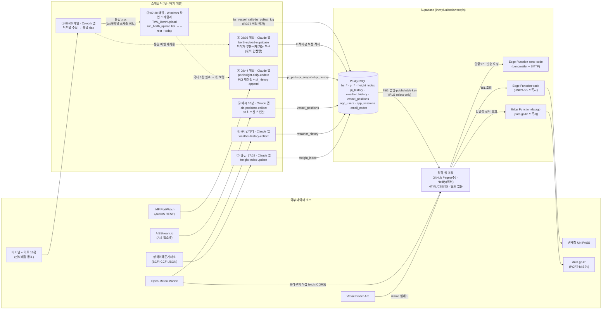
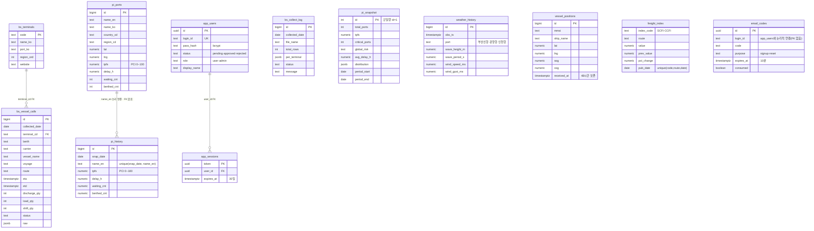
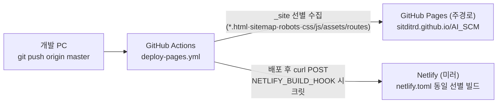

# TWL Control Tower — 아키텍처 문서

**v1.1 · 2026-08-03** · 태웅로직스 IT · 문의 itt@twsc.co.kr

> 근거 문서: `README.md` · `docs/03-architecture/상세기술서_TWL물류포털.md` · `docs/06-operations/스케줄러_체계.md` · `sql/setup_supabase.sql` · `sql/setup_supabase_berth.sql` · `sql/setup_history.sql` · `supabase/auth_setup.sql` · `scripts/run_berth_upload.bat` · `netlify.toml` · `.github/workflows/deploy-pages.yml`

---

## 1. 시스템 개요

TWL Control Tower는 항만 혼잡도(PCI)·선석배정·선박 위치·화물 추적·경로 분석·해외 스케줄을 제공하는 사내 물류 관제 포털이다. 시스템은 **3계층으로 분리**되며, 각 계층은 Supabase를 경계로 서로 독립적으로 동작한다.

| 계층 | 구성 | 결합 방식 |
|---|---|---|
| **수집(배치)** | Python 수집기 6종 + 스케줄러 7종(Cowork 앱 ① · Windows 작업 스케줄러 ② · Claude 앱 ③~⑦) | ②는 `--rest` 모드로 Supabase REST 직접 적재, 나머지는 `--sql` 모드로 SQL 파일 생성 → Supabase MCP로 적재(쓰기) |
| **저장** | Supabase PostgreSQL (프로젝트 `kvmyiualdodcvreoqfin`) | RLS로 읽기/쓰기 권한 분리 |
| **표현(정적 웹)** | 빌드 없는 순수 HTML/CSS/JS — GitHub Pages·Netlify | publishable key로 select만, 45초 폴링 |

분리 원칙의 효과: 웹은 빌드·서버 없이 `git pull`만으로 서빙 가능하고, 수집 PC와 웹 배포가 서로를 몰라도 Supabase를 통해 연계된다. Supabase 장애 시 각 페이지는 정적 시드로 폴백하고 오프라인 배너를 표시한다.

---

## 2. 시스템 구성도

- **②가 주 경로, ③이 안전망**: ②는 Claude 앱 기동 여부와 무관하게 07:30에 정시 적재하고, ③은 최근 7일 건수를 비교해 미적재·부분적재분만 보충한다. 둘 다 동일 수집일 replace(멱등)라 중복 실행해도 안전하다.
- **④가 ② 이후인 이유**: 부산·광양·인천의 접안/대기 척수를 당일 선석 실측으로 보정하기 때문에, 선석 적재가 끝난 뒤에 PCI를 재산출한다.

---

## 3. 컴포넌트 명세

### 3.1 정적 웹 (HTML 10개 + JS 모듈)

| 화면 | 주요 JS 모듈 | 역할 |
|---|---|---|
| `index.html` | `landing.js` | 홈 — KPI 스트립(Supabase 모드), 운임지수 스트립, 히어로 캔버스, 한/영/중 다국어(`i18n.js`) |
| `insight.html` | `data.js` · `insight.js` | Port Insight — PCI 게이지·분포·권역·Leaflet 지도·순위, 포트 검색 |
| `berth.html` | `data_berth.js` · `berth.js` · `weather.js` | 선석배정 — 16터미널 고급 그리드(필터·검색·마감임박 강조), 항만 기상 카드, 우클릭 Excel 내보내기 |
| `vessel.html` | `vessel.js` | 선박 위치 — VesselFinder AIS 지도 임베드, PORT-MIS 입출항 실적 조회(Edge Function `datago`), 자체 AIS 수신 지도(Leaflet · `vessel_positions`, 5분 재조회) |
| `cargo.html` | `cargo.js` | 화물 추적 — UNIPASS 조회(Edge Function `track` / 로컬 `server.py` 프록시) + 딥링크 |
| `route.html` | `route.js` | 경로 분석 — 몬테카를로 소요일 분포, CARTO Voyager 지도 항로 시각화(사전계산 `routes/` 93개 JSON) |
| `schedule.html` | — | 해외 스케줄 — 준비중(기획 화면, FR-04/05) |
| `status.html` | `status.js` | 데이터 현황(관리자 전용) — 판정 배너·흐름도·신선도 게이지·7일 적재 타임라인(`berth_daily_counts` RPC 실적 기준)·외부 연동 헬스체크(Edge Function track/datago/send-code·Open-Meteo, 45초 주기) |
| `login.html` | `auth.js` | 로그인·회원가입·비밀번호 찾기(이메일 인증코드, 비밀번호 강도 미터) |
| `admin.html` | `auth.js` | 관리자 — 가입 승인/거부, 비밀번호 재설정 |

공통 모듈: `common.js`(로고·라이트/다크 테마·헤더), `i18n.js`(다국어, localStorage `twl-lang`), `auth-gate.js`(미로그인 시 일정시간 후 blur + 로그인 유도 — UX 억제 수준, 완전한 보안 아님).

### 3.2 배치 수집기 (`scripts/`)

| 스크립트 | 역할 | 대상 테이블 |
|---|---|---|
| `collect_upload_berth.py` | 선석배정 통합 엑셀 파싱 → 일일 적재. 시트별 컬럼 매핑(MAP)으로 이질 스키마 정규화 | `bs_vessel_calls` · `bs_collect_log` |
| `collect_portinsight_api.py` | IMF PortWatch(ArcGIS FeatureServer) → PCI 지수 산출(활동량 0.60 + 물동량 0.25 + 모멘텀 0.15). 부산·광양·인천은 `bs_vessel_calls` 실측으로 보정 | `pi_ports`(93) · `pi_snapshot` · `pi_history` |
| `collect_freight_index.py` | SCFI/CCFI 수집(상하이해운거래소 JSON, Referer 필요·CORS 불가로 배치 경유). KCCI는 미지원 | `freight_index` |
| `collect_ais_positions.py` | AISStream.io 웹소켓 90초 수신 → 한국 연안 선박 위치 스냅샷(연안 약 200km 이내만 수신) | `vessel_positions`(48시간 보존) |
| `collect_weather_history.py` | Open-Meteo 현재 기상(파고·파주기·풍속·돌풍) 3항(부산신항·광양항·인천항) 이력 축적 — 예측 분석용 | `weather_history` |
| `backfill_upload_berth.py` | 과거분 일괄 백필 — 헤더 변형 VARIANTS 자동 대응, `--dry-run` 검증 | `bs_vessel_calls` |

보조: `upload_berth_sql_parts.py` — 일일 선석 적재 전용. 기존 `--sql`(분할 SQL 생성) 외에 2026-08-03에 `--rest`(Supabase REST 직접 적재, SQL 파일 불필요)·`--today`(당일 통합 엑셀 자동 탐색, 없으면 최근 파일 대체) 모드가 추가되어 스케줄러 ②가 사용한다.

`scripts/run_berth_upload.bat`는 Windows 작업 스케줄러(② `TWL_BerthUpload`)의 진입점으로 `upload_berth_sql_parts.py --rest --today`를 호출하고 `logs/berth_upload.log`에 기록하며 항상 exit 0으로 종료한다. **이 배치 파일은 ASCII 전용으로 유지해야 한다** — cmd.exe가 `.bat`를 콘솔 코드페이지로 파싱하므로 한글이 섞이면 줄이 깨진 채 작업이 "성공(결과 0)"으로 끝나면서 실제로는 아무 일도 하지 않는다(2026-08-03 실측 장애).

②를 제외한 수집기는 `--sql` 모드로 SQL 파일만 생성하고, 실제 DB 쓰기는 스케줄러의 Claude 세션이 Supabase MCP로 실행한다. 적재는 동일 수집일 delete 후 insert(멱등)이므로 ②·③이 겹쳐 실행돼도 안전하다. 수집 스크립트에는 `env_key()`가 추가되어 환경변수가 상속되지 않은 경우 Windows 사용자 환경변수 레지스트리에서 키를 직접 읽는다(`setx` 직후 재시작 불필요).

### 3.3 Edge Functions (`supabase/functions/`) — 3종

| 함수 | 역할 | 시크릿 |
|---|---|---|
| `send-code` | 가입·비밀번호 재설정 인증코드 이메일 발송 (denomailer + 본인 SMTP, 네이버 `smtp.naver.com:465`) | `SMTP_HOST/PORT/USER/PASS/FROM` |
| `track` | 관세청 UNIPASS 화물통관진행정보 프록시 (정적 사이트에서 직접 호출, `verify_jwt=false`). 키 미등록 시 `needKey` 안내 반환 | `UNIPASS_API_KEY`(미등록 대기) |
| `datago` | data.go.kr 공용 API 프록시 — 별칭 화이트리스트(`portmis` 입출항 실적 · `aircargo`)로 허용 대상만 중계. 키 미등록 시 `needKey` 안내 반환 | `DATA_GO_KR_KEY`(미등록 대기) |

`UNIPASS_API_KEY`·`DATA_GO_KR_KEY`는 2026-08-03 기준 미등록 상태이며, 시크릿 등록 즉시 코드 수정 없이 동작한다.

### 3.4 인증 서브시스템

- **방식**: Supabase 커스텀 인증(Supabase Auth 미사용) — 이메일+비밀번호(bcrypt), 이메일 인증코드(OTP) 가입, 관리자 승인, 30일 세션 토큰.
- **가입 흐름**: 인증코드 발송(`send-code`) → 코드 검증 후 가입 신청(pending) → 관리자 승인(`admin.html`) → 로그인.
- **DB 함수**(`supabase/auth_setup.sql`, 전부 SECURITY DEFINER·anon 실행 권한): `app_login` · `app_me` · `app_logout` · `app_signup_verified` · `app_reset_with_code` · `app_admin_list` · `app_admin_set_status` · `app_admin_reset_pw`.
- 인증 테이블 3종은 RLS만 활성화하고 정책이 없어 anon이 직접 접근할 수 없다 — 위 함수를 통해서만 접근.

### 3.5 로컬 백엔드 (배포 대상 아님)

`server.py`(포트 8090) — UNIPASS·searoute·data.go.kr 프록시. **로컬 전용**이며 GitHub Pages/Netlify 배포판에서는 동작하지 않는다(해당 화면은 미연결 안내 표시).

---

## 4. 데이터 모델

핵심 컬럼만 표기. 근거: `sql/setup_supabase.sql`(pi_*), `sql/setup_supabase_berth.sql`(bs_*), `sql/setup_history.sql`(이력 3종·RPC), `supabase/auth_setup.sql`(인증 3종). `freight_index`는 셋업 SQL 없이 운영 중이며 컬럼은 `sql/upload_freight.sql` upsert 문 기준.

- `bs_vessel_calls` 인덱스: `(collected_date desc)`, `(terminal_cd, collected_date desc)`. 적재는 동일 `collected_date` delete 후 insert.
- `bs_terminals`는 운영 기준 16행(셋업 SQL의 초기 시드는 9행, 2026-07-29 FR-02로 16개 확대 적재).
- `pi_ports`는 Focus 포트 93행, `pi_snapshot`은 id=1 단일행. 컬럼명 `tpfs`는 구용어(TW-PFS) 유지분으로, 화면 표기는 PCI로 표준화됨.
- **이력 3종**(`pi_history`·`weather_history`·`vessel_positions`)은 예측 분석용 축적 테이블로, 전부 RLS 활성화 + 익명 select 정책만 부여. `pi_ports`가 매일 덮어써지므로 ④ 갱신 직후 `pi_history`에 일별 append하고, `vessel_positions`는 적재 시 48시간 경과분을 삭제한다.
- **RPC `berth_daily_counts(days int default 7)`** → `(collected_date date, cnt bigint)`. `stable`·security invoker, anon/authenticated 실행 허용. PostgREST 집계가 비활성이라 도입했으며, `status.html` 7일 타임라인이 적재 로그(`bs_collect_log`)가 아닌 **실제 적재 실적** 기준으로 판정하도록 바꾼 근거다(실적 있으면 ✓건수, 실적 없이 실패 로그만 있으면 ✗ — 로그 누락·건수 불일치에 좌우되지 않음).

---

## 5. 배포 토폴로지

- **주경로 — GitHub Pages**: `master` push 시 `deploy-pages.yml`이 `_site/`에 웹 파일만 선별 복사(`*.html`, `sitemap.xml`, `robots.txt`, `css/ js/ assets/ routes/`) 후 배포. 사업문서(`docs/`)·수집기(`scripts/`)·SQL 덤프는 게시 제외. 저장소가 private이 되면 무료 계정 Pages가 꺼지므로 public 유지 필요.
- **미러 — Netlify**: 배포 잡 마지막에 `NETLIFY_BUILD_HOOK`(GitHub Secrets)로 빌드 훅 POST(미설정 시 조용히 건너뜀). `netlify.toml`도 동일한 `_site` 선별 복사를 수행해 두 배포본의 게시 범위를 일치시킨다.
- **캐시 전략**: HTML은 캐시버스팅이 없으므로 항상 재검증(`Cache-Control: max-age=0, must-revalidate` — Netlify 헤더), css/js는 `?v=` 쿼리 버스팅 사용, `/assets/*`는 7일 캐시(`max-age=604800`). 공통 보안 헤더: `X-Frame-Options: SAMEORIGIN`, `X-Content-Type-Options: nosniff`.

---

## 6. 보안 모델

| 항목 | 내용 |
|---|---|
| 클라이언트 키 | **publishable key만 노출**. 전 데이터 테이블 RLS 활성화, 익명은 select 정책만(`pi_*`(`pi_history` 포함)·`bs_*`·`freight_index`·`weather_history`·`vessel_positions`) — 쓰기 불가 |
| 인증 테이블 | `app_users`·`app_sessions`·`email_codes`는 RLS 활성화 + **정책 없음** → anon 직접 접근 차단. 접근은 **SECURITY DEFINER 함수 8종**(anon execute grant)으로만 |
| 비밀번호 | bcrypt 해시(`crypt` + `gen_salt('bf')`, pgcrypto). 평문 미저장 |
| service_role 키 | 원칙은 **PC 미보관**(수집기는 `--sql` 모드로 SQL 파일만 생성하고 DB 쓰기는 스케줄러 세션이 Supabase MCP로 실행). **②(Windows 작업 스케줄러)만 예외** — 앱과 무관한 정시 REST 적재를 위해 2026-08-03부터 `SUPABASE_SERVICE_KEY`를 PC 사용자 환경변수로 보관한다. 저장소 커밋은 금지 |
| 시크릿 위치 | GitHub Secrets: `NETLIFY_BUILD_HOOK` · Supabase Edge Functions Secrets: `SMTP_HOST/PORT/USER/PASS/FROM`, `UNIPASS_API_KEY`(미등록), `DATA_GO_KR_KEY`(미등록) · 수집 PC 사용자 환경변수: `SUPABASE_SERVICE_KEY`(②), `AISSTREAM_API_KEY`(⑤) |
| 무인 실행 권한 | Claude 앱 스케줄(③~⑦)이 승인 대기 없이 돌도록 `~/.claude/settings.json`의 `permissions.allow`에 필요한 도구만 한정 허용(PowerShell `python *` · Bash `python *` · Read · Supabase `execute_sql`), `additionalDirectories`에 `%TEMP%\berth_sql_parts` 추가 |
| 화면 게이트 | 미로그인 blur 게이트(`auth-gate.js`)는 정적 사이트 특성상 UX 억제 수준 — 데이터 자체는 RLS select-only로 보호 |

---

## 7. 기술 스택 요약

| 구분 | 기술 |
|---|---|
| 프런트엔드 | 순수 HTML/CSS/JS(빌드 없음), Leaflet + CARTO 타일, SheetJS(지연 로드, Excel 내보내기), 라이트/다크 CSS 토큰 |
| 데이터베이스 | Supabase PostgreSQL (프로젝트 `kvmyiualdodcvreoqfin`), RLS, SECURITY DEFINER 함수, `berth_daily_counts` RPC, pgcrypto |
| 서버리스 | Supabase Edge Functions (Deno) 3종 — `send-code`(denomailer), `track`(UNIPASS 프록시), `datago`(data.go.kr 프록시) |
| 배치 | Python (openpyxl, requests, websocket) — ②는 `--rest` REST 직접 적재, 나머지는 `--sql` 생성 + Supabase MCP 적재 |
| 스케줄러 | 7종 — Cowork 앱 ①(06:00 수집) + **Windows 작업 스케줄러 ②**(07:30 `TWL_BerthUpload`) + Claude 앱 예약 작업 ③~⑦(08:03 선석 복구·08:44 PCI·매시 30분 AIS·6시간마다 기상·월금 17:02 운임지수) |
| CI/CD | GitHub Actions (`deploy-pages.yml`) → GitHub Pages(주) + Netlify 빌드 훅(미러) |
| 외부 연동 | IMF PortWatch(ArcGIS REST), 상하이해운거래소(SCFI/CCFI), Open-Meteo Marine(브라우저 직접 + 이력 배치), AISStream.io(웹소켓 AIS), VesselFinder AIS(iframe), 관세청 UNIPASS, data.go.kr(PORT-MIS 등) |
