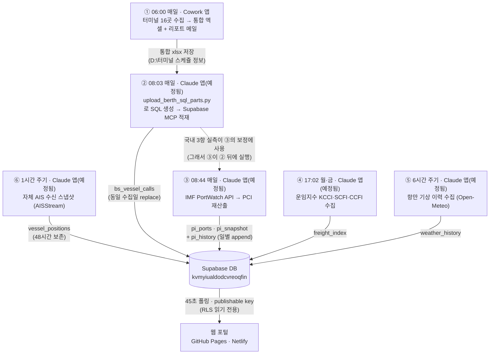

# 스케줄러 체계 (2026-08-19 기준)

TWL Control Tower의 데이터 파이프라인은 **스케줄러 9개**로 구성된다.
①~⑥은 Claude 계열 앱의 내장 스케줄러이고, Windows 작업 스케줄러에는 **세 건**이 등록돼 있다 —
⑦ `TWL_BerthUpload`(②의 정시 보장 이중화 → [이중화](#이중화--정시-적재-보장)),
⑧ `TWL_BlWatch`(BL 추적 감시 → [⑧](#-bl-추적-감시-twl_blwatch--2026-08-11-신설)),
⑨ `TWL_CarrierCanary`(선사 어댑터 주간 점검 → [⑨](#-선사-어댑터-주간-카나리아-twl_carriercanary--2026-08-14-신설)).



## 작업별 상세

| # | 시각 | 등록 위치 | 작업 ID | 하는 일 | 산출물 |
|---|---|---|---|---|---|
| ① | 매일 06:00 | **Cowork 앱** › 예약된 작업 | Terminal schedule collection | 터미널 16곳 웹 수집 → 터미널별/통합 엑셀 생성 → itt@twsc.co.kr 리포트 메일 | `D:\터미널 스케쥴 정보\터미널_선석배정현황_통합_YYYYMMDD.xlsx` |
| ② | 매일 08:03 | **Claude 앱** › 예정됨 | `berth-upload-supabase` | ①의 엑셀 파싱(scripts/backfill_upload_berth.py 파서) → 분할 SQL 생성(scripts/upload_berth_sql_parts.py) → Supabase MCP로 적재. 최근 7일 미적재 날짜 자동 캐치업 | `bs_vessel_calls` + `bs_collect_log` |
| ③ | 매일 08:44 | **Claude 앱** › 예정됨 | `portinsight-daily-update` | scripts/collect_portinsight_api.py --sql → MCP 실행. 부산·광양·인천 접안/대기는 ②의 실측으로 보정. 갱신 후 `pi_history`에 일별 스냅샷 append(예측 분석용) | `pi_ports`(93) · `pi_snapshot` · `pi_history` |
| ④ | 월·금 17:02 | **Claude 앱** › 예정됨 | `freight-index-update` | scripts/collect_freight_index.py --sql → MCP 실행 (KCCI 월요일·SCFI/CCFI 금요일 발표 주기에 맞춤) | `freight_index` |
| ⑤ | 6시간 주기(00·06·12·18시) | **Claude 앱** › 예정됨 | `weather-history-collect` | scripts/collect_weather_history.py --sql → MCP 실행. 부산신항·광양·인천 파고·풍속 이력 축적(예측 분석 Phase 1, 2026-07-31 신설. 스키마: sql/setup_history.sql) | `weather_history` |
| ⑦ | 매일 07:30·09:30·12:00·15:00 | **Windows 작업 스케줄러** | `TWL_BerthUpload` | `run_berth_upload.bat` → `upload_berth_sql_parts.py --rest --today`(REST 직접 적재·최근 3일 캐치업). ②의 정시 보장 이중화 | `bs_vessel_calls` + `bs_collect_log` |
| ⑧ | 매일 08:20·20:20 | **Windows 작업 스케줄러** | `TWL_BlWatch` | `run_bl_watch.bat` → `collect_bl_watch.py`. 등록 BL 조회→스냅샷→변경 감지→ETD/ETA 알림 | `bl_snapshot` · `bl_change_log` · 메일 |
| ⑥ | 1시간 주기(매시 30분경) | **Claude 앱** › 예정됨 | `ais-positions-collect` | scripts/collect_ais_positions.py --sql → MCP 실행. AISStream 웹소켓으로 한국 연안 선박 위치 90초 수신 스냅샷(환경변수 AISSTREAM_API_KEY 필요, 48시간 보존). vessel.html 자체 AIS 지도 레이어가 표시 | `vessel_positions` |

## ⑧ BL 추적 감시 (TWL_BlWatch · 2026-08-11 신설)

| 항목 | 내용 |
|---|---|
| 시각 | 매일 **2시간 주기** 06:20~22:20 (9회). 단 실제 조회는 **적응형 폴링**으로 대상이 매번 다르다 |
| 등록 위치 | **Windows 작업 스케줄러** `TWL_BlWatch` → `scripts/run_bl_watch.bat` |
| 하는 일 | `bl_watch`(active) 목록 → **B/L 단위 그룹화** → Edge Function `carrier-track` 조회 → `bl_snapshot` 적재 → 직전 스냅샷과 비교 → 변경을 `bl_change_log` 기록 → **ETD/ETA·국내 터미널 변경만** `notify-bl` 로 **계정별 메일 발송**. 추가로 `bs_vessel_calls` 최신 vs 직전 수집분을 대조해 **터미널발 ETB/ETD 변동**도 감지한다(2026-08-19 P6) |
| 산출물 | `bl_snapshot` · `bl_change_log` · 메일 |
| 종료 조건 | ① 공컨 반납 확인 시 ② **`expires_at` 도달 시**(등록 시 선택한 3/6개월) — 둘 중 먼저 오는 쪽에서 `active=false` |
| 로그 | `logs/bl_watch.log` |

- **적응형 폴링**: 스케줄러는 2시간마다 깨어나지만 등급별 `next_poll_at` 이 지난 건만 조회한다. near(ETD/ETA ±3일)=3h · transit(운송중~양하)=12h · pre(선적대기)=24h · 실패=30분 후 재시도. 총 호출량은 하루 2회와 비슷하게 유지하면서 임박 구간의 반응성만 올린다(선사 레이트리밋 회피). 같은 회차 내에서는 선사를 번갈아 호출해 SITC 429(연속 5~6회)를 피한다.
- 알림 종류는 `collect_bl_watch.py` 의 `NOTIFY` 딕셔너리로 제어한다.
  현재 `etd`·`eta`·**`tml`(국내 터미널 접안/출항 변경 — 2026-08-19 P6 추가)** 이 True 이고,
  `vessel`(본선·항차)·`stage`(단계 진입)·`gate`(반출·반납)는 **감지·기록만 하고 발송 안 함**(2026-08-11 사용자 결정). 나중에 True 로 바꾸면 코드 수정 없이 활성화된다.
- 중복 발송 방지: 발송 성공분만 `bl_change_log.notified=true` 로 마감하며, **이번 실행에서 기록된 건만** 마감 대상이라 과거 실패분이 덮이지 않는다.
- 화면: cargo.html **SECTION 03 '등록 화물 자동 감시'** 그리드(등록/해제/상태/알림 종/진행/구간/ETD·ETA/변경/남은기간/최근 수집, 20행 페이지네이션)와 **SECTION 02 '스케줄 변경 피드'**(감시 화물 전체의 최근 변경 통합), 좌측 레일의 감시 요약. 종료 건은 수집이 멈추므로 알림 종이 비활성으로 표시된다. 등록·해제는 Edge Function `bl-watch` 경유(정적 사이트는 RLS 로 쓰기 불가).
- **소유자 격리**: 모든 호출에 앱 세션 토큰을 실어 보내고 `bl-watch` 가 **`app_me` RPC 로 서버에서 신원을 검증**한다.
  일반 사용자는 자기가 등록한 건만 조회·해제할 수 있고 관리자(role=admin)는 전체를 본다.
  클라이언트가 보낸 `created_by` 는 신뢰하지 않으며(토큰 검증 결과만 소유자로 기록), 비로그인은 목록이 빈 채로 반환된다.
- **감시는 계정별로 독립이다 (2026-08-19 변경)**: `bl_watch` 의 유일성 제약을 `mbl_no` 단독 → **`(mbl_no, created_by)` 복합키**로
  바꿨다(마이그레이션 `bl_watch_per_account_unique`, `bl-watch` v10 배포).
  **왜 바꿨나** — B/L당 전역 1행이라 다른 계정이 같은 B/L 을 등록하면 upsert 의 `merge-duplicates` 가
  **남의 행을 통째로 덮어썼다.** 실사고로 17:25에 등록된 건이 17:41 재등록으로 소멸했고, 알림 수신자도
  행당 1명이라 먼저 등록한 사람은 감시도 메일도 함께 잃었다. 지금은 같은 B/L 이 계정 수만큼 행으로 공존한다.
- **수집기는 B/L 단위로 1회만 조회하고, 메일만 계정별로 팬아웃한다**: 같은 B/L 의 여러 행을 한 그룹으로 묶어
  **선사 조회·스냅샷 적재·변경로그 기록은 1회**만 하고(선사 호출량이 등록 계정 수만큼 늘어나면 레이트리밋에 걸린다),
  **알림 메일만 행별 수신 주소로 각각 발송**한다(같은 주소는 1통). 실패·폴링 등급 갱신은 `id=in.(…)` 로 그룹 일괄 처리하며,
  로그에는 `등록 N계정` 이 함께 찍힌다. 발송 시도한 종류는 `bl_change_log.notified` 로 마감해 재실행 시 중복 발송을 막고,
  일부 주소만 실패하면 그 사유를 `notify_error` 에 남긴다.

## ⑨ 선사 어댑터 주간 카나리아 (TWL_CarrierCanary · 2026-08-14 신설)

| 항목 | 내용 |
|---|---|
| 시각 | **매주 일요일 08:00** (주 1회) |
| 등록 위치 | **Windows 작업 스케줄러** `TWL_CarrierCanary` → `scripts/run_canary.bat` |
| 하는 일 | 가동 중인 선사마다 실제 B/L 로 조회 → 결과 형태 검증 → 지난주 기준선과 비교 → 수집 파이프라인 건전성 확인 → **이상이 있을 때만** 메일 |
| 산출물 | `logs/canary.log` · `logs/canary_baseline.json`(git 제외) · 이상 시 메일 |
| 수신처 | 환경변수 `CANARY_EMAIL`(미설정 시 `itt@twsc.co.kr`) |
| 로그 | `logs/canary.log` · 래퍼는 `logs/canary_run.log` |

**왜 필요한가** — 이 시스템의 주된 실패 양식은 **조용한 고장**이다. 선사가 응답 구조를 바꾸면
조회는 HTTP 200 인데 내용만 비어 오고, 수집기는 정상 종료(exit=0)하며 스케줄러에도 빨간불이
안 뜬다. COSCO 에서 실제로 겪었다(bill 응답의 컨테이너 이벤트가 전건 null 로 바뀐 건).

**감지 항목**

| 항목 | 이상 판정 |
|---|---|
| 컨테이너 수 | 0건 |
| 이벤트 수 | 0건, 또는 지난주 대비 50% 미만으로 급감(기준선 4건 이상일 때만) |
| 슬롯 매핑 | 이벤트는 오는데 9개 게이트 슬롯에 하나도 안 걸림 = **선사가 이벤트 어휘를 바꿈**(화면 표가 빈다) |
| 수집기 기동 | 최근 7일 `[FAIL] python not found` / `collector returned N` 1건이라도 |
| 건별 조회 실패 | 최근 7일 10건 이상(SITC 429 같은 일시 장애와 구분하기 위한 임계치) |
| 스냅샷 증가 | 감시 대상이 있는데 최근 7일 스냅샷 0건 = 수집기가 안 도는 것 |

**설계 원칙 — 코드를 자동으로 고치지 않는다.** 잘못된 자동 수정은 멀쩡히 돌던 선사를 통째로
죽이고, 주말이라 월요일까지 아무도 모른다. **감지는 자동, 수정은 사람 확인 후**다.
이상 메일을 받으면 원인을 확인하고 수동으로 고친다.

**거짓 경보 방지 장치**(전부 실측으로 필요성이 확인된 것)

- **프로브 B/L 자동 갱신**: 고정 B/L 은 선사가 오래된 건을 정리하면 빈 응답이 되어 매주 거짓
  경보를 낸다. `bl_watch` 의 활성 등록분 → 종료 등록분 → 예비(PINNED) 순으로 고른다.
  종료 건도 프로브로는 유효하다(어댑터가 깨졌는지 보는 데 충분).
- **1회 실패로 단정하지 않음**: 실패 시 50초 후 1회 재시도. SITC 는 연속 호출 시 429 로 지연되고
  45초쯤 뒤 복구된다. 선사 간 3초 간격도 둔다.
- **로그 [FAIL] 은 최근 7일만**: 실행 블록(`===== 날짜 =====`) 단위로 끊어 센다. 전체를 세면 몇 달 전
  일시 장애가 계속 잡혀 매주 같은 경보가 난다(실측: SITC 429 두 건이 계속 카운트됐다).
- **성격 구분**: 수집기 기동 실패는 1건도 보고, 건별 조회 실패는 임계치 초과 시에만 보고.

**수동 실행**

```
python scripts\canary_carriers.py --dry-run     # 메일 미발송·기준선 미갱신
python scripts\canary_carriers.py --force-mail  # 이상 없어도 발송(메일 경로 점검)
```

## 실행 모델

- 예약 시각이 되면 해당 앱이 **자율 Claude 세션을 자동 기동**하고, 그 세션이 지침(SKILL.md)대로 .py 실행·MCP 적재·검증·결과 보고까지 수행한다.
  ②③④의 지침 파일: `C:\Users\Administrator\.claude\scheduled-tasks\<작업ID>\SKILL.md`
- **service_role 키가 PC에 저장되지 않는다** — .py는 SQL 파일만 생성하고, DB 쓰기는 Claude 세션이 Supabase MCP로 실행한다(--sql 모드).
- 모든 적재는 **동일 수집일 delete 후 insert(멱등)** — 재실행·중복 실행에 안전하다.
- **앱이 켜져 있어야 실행된다.** 꺼져 있으면 다음 앱 실행 시점에 밀린 작업이 돈다. 절전 모드 방지 옵션을 켜둘 것.
  (2026-08-03 실측: 08:03에 앱이 꺼져 있어 08-02·08-03 두 날짜분이 앱 기동 후 09:10~09:27에 함께 적재 — **유실이 아니라 지연**이며 ②의 건수 비교 캐치업이 정상 작동했다.)

## 이중화 — 정시 적재 보장

앱 기동 시각과 무관하게 정시 적재가 필요해 ②를 **Windows 작업 스케줄러로 이중화**했다.
`scripts/upload_berth_sql_parts.py --rest --today` 가 SQL 파일 없이 REST로 직접 적재하며,
동일 수집일 replace(멱등)라 앱 스케줄러 ②와 중복 실행돼도 데이터가 깨지지 않는다.

**2026-08-03 등록 완료** — `TWL_BerthUpload` 작업이 **매일 07:30 / 09:30 / 12:00 / 15:00 네 번** 실행된다.
07:30은 06시 수집 완료 직후의 정시 적재이고, 나머지 셋은 **수집이 늦어져 07:30이 헛돌았을 때의 재시도**다
(2026-08-04 추가). `--today` 는 실행할 때마다 **최근 3일치** 중 파일이 있는 날짜를 대상으로 삼되,
**지난 적재 이후 파일이 변하지 않은 날짜는 건너뛴다**(2026-08-14 — 파일 서명을 `logs/berth_upload_state.json`
에 기억). 그래서 재시도가 곧 캐치업이 되면서도, 과거 날짜의 적재 시각이 매 실행 갱신되지 않아
'언제 실제로 바뀌었나' 를 화면에서 그대로 읽을 수 있다. 강제 재적재는 `--force`.

```powershell
# 1) 키 등록 — Supabase 대시보드 → Project Settings → API Keys → service_role(또는 secret key)
setx SUPABASE_SERVICE_KEY "<service_role key>"
# 2) 작업 등록 (PowerShell). 경로에 공백·괄호가 있어 schtasks 보다 cmdlet 이 안전하다
$bat = "<REPO>\scripts\run_berth_upload.bat"
Register-ScheduledTask -TaskName "TWL_BerthUpload" -Force `
  -Action (New-ScheduledTaskAction -Execute $bat) `
  -Trigger @(07:30, 09:30, 12:00, 15:00 | ForEach-Object { New-ScheduledTaskTrigger -Daily -At $_ }) `
  -Settings (New-ScheduledTaskSettingsSet -StartWhenAvailable -AllowStartIfOnBatteries -DontStopIfGoingOnBatteries -ExecutionTimeLimit (New-TimeSpan -Minutes 15))
```

- 실행 로그: `logs/berth_upload.log` — `[OK] <날짜> N건 REST 적재 완료` + `exit=0` 이면 정상
- 현재 트리거 확인: `(Get-ScheduledTask -TaskName "TWL_BerthUpload").Triggers | Select-Object StartBoundary` / 제거: `schtasks /delete /tn "TWL_BerthUpload" /f`
- ⚠️ **배치 파일은 ASCII 전용으로 유지할 것.** cmd.exe 는 .bat 를 콘솔 코드페이지로 파싱하므로 한글 주석·메시지가 있으면 줄이 깨져 **작업은 "성공(결과 0)"으로 끝나면서 실제로는 아무 일도 하지 않는다**(2026-08-03 실측). 로그가 아예 생성되지 않으면 이 증상을 먼저 의심한다.
- **트레이드오프**: 이 경로는 service_role 키를 PC에 저장한다(사용자 환경변수). 키 미보관 원칙을 유지하려면 작업을 지우고 앱 캐치업에만 의존해도 데이터는 결국 적재된다(표시만 지연).
- 수동 1회 실행: `python scripts\upload_berth_sql_parts.py --rest --today`
- ②(앱 스케줄러)는 그대로 유지한다 — 최근 7일 **건수 비교**로 미적재·부분적재를 자동 복구하므로, 이 이중화가 실패한 날의 안전망이 된다.

## 해결된 장애 — ② 선석 적재 2일 공백 (2026-08-10 ~ 08-11, 08-11 복구)

`bs_vessel_calls` 적재가 **08-10·08-11 두 날짜분 누락**됐다. 원인은 로컬 코드도 터미널 공표도 아닌
**06시 수집기(①)의 산출 위치 변경**이다.

| 확인 항목 | 결과 |
|---|---|
| 06시 수집기 실행 여부 | **정상** — 터미널별 폴더에 08-11 06:56 파일까지 생성됨 |
| 통합 xlsx 존재 여부 | **존재** — 단 `통합\2026\08\` 아래에 있음 (루트에는 없음) |
| `통합` 폴더 생성 시각 | 2026-08-09 18:13 — 이 시점에 아카이브 구조로 전환되며 **기존 루트 파일도 함께 이동** |
| `upload_berth_sql_parts.py` 탐색 범위 | `DATA_DIR` **루트만** → 08-10부터 매 실행 `[SKIP]`(exit=1) |

즉 수집은 계속 성공하고 있었는데 적재기가 파일을 못 찾았다. `--today` 캐치업이 **최근 3일**만 보므로
방치했다면 08-12에 08-09분이 범위를 벗어나 실제 유실로 굳었을 상황이다.

**조치** — `integrated_path()` 를 신설해 루트와 `통합\YYYY\MM\` 를 **모두** 탐색하도록 수정하고
(확장자 `.xlsx`/`.xls` 병행 확인은 유지), 캐치업을 수동 실행해 3일치를 복구했다:
08-09 498건 · 08-10 515건 · 08-11 510건 (`bs_collect_log` SUCCESS 확인).

**교훈** — `[SKIP]` 은 exit=1 로 끝나지만 **작업 스케줄러 이력에는 실패로 크게 드러나지 않는다.**
`logs/berth_upload.log` 에 `[OK]` 가 연속으로 사라지면 그 자체가 신호다.
06시 수집기는 앱(Cowork) 측 로직이라 우리 통제 밖에서 산출 경로가 바뀔 수 있으므로,
적재기는 **경로 변경에 관대하게** 탐색한다.

## 알려진 장애 — ⑥ AIS 수집 (2026-08-10 기준 진행 중)

`vessel_positions` 적재가 **2026-08-04 17:32 이후 중단**된 상태다. 2026-08-10 재진단 결과 **원인은 aisstream.io 업스트림**이며 로컬에서 고칠 수 있는 것이 없다.

진단 근거(2026-08-10 실측):

| 확인 항목 | 결과 |
|---|---|
| TLS·웹소켓 핸드셰이크 | **정상** (과거 인증서 만료 장애와 다름) |
| API 키 | 레지스트리에 정상 등록(40자 hex), 서버가 거부하지 않음 |
| 한국 연안 bbox / 90초 | 프레임 **0개** |
| 전세계 bbox·필터 해제 / 30초 | 프레임 **0개** — bbox·필터 문제 아님 |
| 일부러 잘못된 키로 구독 | 오류 응답조차 **없음** |

**"규격 변경으로 우리 구독이 무시되는 것" 가능성은 대조군 테스트로 배제됐다:**

| 보낸 것 | 서버 반응 | 판정 |
|---|---|---|
| 구독 메시지 미전송 | **4.4초에 연결 종료** | 서버가 죽은 게 아님 — 3초 규칙을 정상 집행 중 |
| 정상 키·정상 규격 구독 | 28초간 유지, 프레임 0 | 구독은 **수락**됨, 데이터만 안 옴 |
| 필수 필드(BoundingBoxes) 누락 | 16초간 유지, 오류 없음 | 내용 검증을 하지 않는 상태 |

규격이 바뀌었다면 우리 구독이 거부돼 첫 행처럼 끊겼어야 하는데 끊기지 않는다.
즉 **연결 관리 계층은 정상이고 스트리밍 계층만 고장**이며, 클라이언트 코드로 우회할 수 없다.

**업스트림 다발 신고(2026-08-10 확인)** — aisstream/issues #268(08-10)·#262("Subscription accepted, zero frames delivered, connection stays open")·#257·#255(한국 커버리지 0건). 특히 **#263은 새 계정·새 API 키로도 0건**이라 계정·키·쿼터 문제가 아님을 확정한다. 전부 `OPEN`이며 운영자 응답이 없고, aisstream.io는 **BETA·SLA 없음**을 명시한다.

**운영 방침** — 스케줄 ⑥은 그대로 두고 유입 재개를 기다린다. 0건이 나와도 키·네트워크·바운딩박스를 다시 점검하지 말 것.
짧은 간격 재시도는 429(rate limit)를 유발하므로 금지한다(2026-08-09 실측).

`collect_ais_positions.py` 종료 코드로 사유를 구분한다:

| 코드 | 의미 | 조치 |
|---|---|---|
| 0 | 정상 수신 → `sql/upload_ais.sql` 생성 | MCP로 적재 |
| 1 | `AISSTREAM_API_KEY` 미등록 | 키 등록 |
| 2 | 접속·핸드셰이크 실패(429/503/TLS 등) | 1회만 재시도 |
| 3 | 업스트림 무응답 / 위치 메시지 0건 | **재시도 없이 건너뜀** (현재 이 상태) |

**복구 판단**: 코드 0이 한 번이라도 나오면 서비스가 돌아온 것이다. 별도 조치 없이 적재가 자동 재개된다.

**재검토 기한**: 관련 업스트림 이슈가 전부 미응답이고 이 서비스는 2026년에만 인증서 만료(5·7월)·데이터 미전송(3월)으로 반복 중단된 이력이 있다. **2026-08-24까지 복구되지 않으면** 무료 복구 대기를 중단하고 대체 소스를 검토한다 — 유료 AIS(MarineTraffic·Datalastic 등) 또는 해수부 연안AIS(15084033, **LINK형이라 datago 프록시로 붙일 수 없어 별도 협의 필요**). 비용이 수반되므로 사용자 의사결정 사항이다.

## 실행 확인 위치

1. Cowork 앱 › 예약된 작업(①) / Claude 앱 사이드바 › 예정됨(②③④) — 실행 이력과 회차별 결과 보고
2. 포털 **데이터 현황(status.html)** — 파이프라인 최신성 게이지·최근 7일 적재 타임라인 (관리자 전용)
3. DB 직접 확인: `select * from bs_collect_log order by created_at desc limit 7;`

## 변경 이력

- 2026-07-31: ②③④ 신규 등록. ③은 당초 07:04였으나 ②(08:03) 이후로 조정 — 국내 3항 보정이 전일이 아닌 당일 실측을 쓰도록 순서 결함 수정. 파서를 헤더 변형(MAP 후보 리스트·공백 무시·`@@` 제거·푸터 행 필터)에 대응하도록 보강.
- 2026-07-31 (예측 분석 Phase 1): ⑤ `weather-history-collect` 신설(6시간 주기) + ③에 `pi_history` 일별 스냅샷 append 단계 추가. 이력 테이블 2종 생성(`sql/setup_history.sql`) — 파고×접안 지연 상관, PCI 추세 예측 등의 원천 데이터 축적 시작.
- 2026-08-03: ⑥ `ais-positions-collect` 신설(매시 30분) + `TWL_BerthUpload`(Windows 작업 스케줄러) 등록으로 ② 이중화 — 스케줄러 총 7종 체제.
- 2026-08-04: `TWL_BerthUpload` 트리거를 07:30 1회 → **07:30/09:30/12:00/15:00 4회**로 확대(수집 지연 시 자동 재시도). `--today` 를 당일 단건 → **최근 3일 캐치업**으로 변경하고, 파일이 없을 때 **과거 파일로 대체 적재하던 동작을 제거**(exit=0 으로 끝나 수집 실패를 감추던 문제). 수집기가 SpreadsheetML `.xls` 로 저장하는 날에 대비해 확장자 병행 탐색 추가.
- 2026-08-10: ⑥ AIS 수집 장애를 **업스트림(aisstream.io) 원인으로 확정**하고 종료 코드 0/1/2/3 분리 — 코드 3(업스트림 무응답)은 재시도 없이 건너뜀. 재검토 기한 2026-08-24.
- 2026-08-11: ② 선석 적재가 **08-10·08-11 누락** — 06시 수집기가 통합 파일을 `통합\YYYY\MM\` 로 아카이브하도록 바뀌었는데 적재기가 루트만 탐색했다. 두 위치를 모두 보도록 수정하고 3일치(08-09~08-11) 캐치업 복구 완료.
- 2026-08-11: ⑧ `TWL_BlWatch` 신설(Windows 작업 스케줄러) — BL 등록·감시·ETD/ETA 알림. 같은 날 적응형 폴링 도입으로 트리거를 2시간 주기 9회(06:20~22:20)로 확대.
- 2026-08-14: ⑨ `TWL_CarrierCanary` 신설(일요일 08:00) — **스케줄러 9종 체제**. 선사 어댑터의 '조용한 고장'(HTTP 200인데 내용만 빔)을 주 1회 점검한다.
- 2026-08-19: ⑧ 을 **계정별 독립 감시**로 전환. `bl_watch` 유일성 제약을 `mbl_no` → **`(mbl_no, created_by)`** 로 바꾸고(다른 계정이 같은 B/L 을 등록하면 남의 행을 덮어쓰던 실사고), 수집기는 **같은 B/L 을 그룹으로 1회만 조회하고 메일만 계정별로 팬아웃**하도록 고쳤다. 같은 날 P6 로 **국내 터미널발 ETB/ETD 변경(`kind=tml`)이 알림 대상에 편입**됐다.
