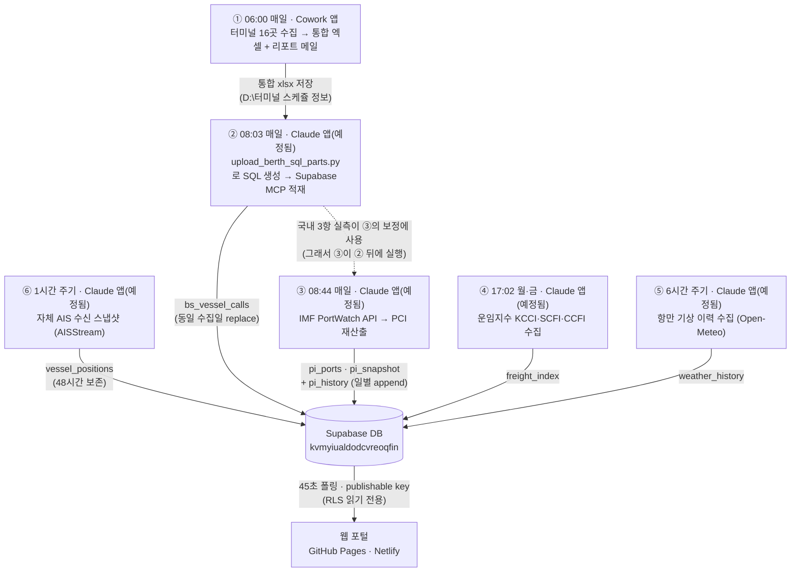

# 스케줄러 체계 (2026-07-31 기준)

TWL Control Tower의 데이터 파이프라인은 **스케줄러 6개**로 구성된다.
윈도우 작업 스케줄러는 사용하지 않으며, 전부 Claude 계열 앱의 내장 스케줄러다.



## 작업별 상세

| # | 시각 | 등록 위치 | 작업 ID | 하는 일 | 산출물 |
|---|---|---|---|---|---|
| ① | 매일 06:00 | **Cowork 앱** › 예약된 작업 | Terminal schedule collection | 터미널 16곳 웹 수집 → 터미널별/통합 엑셀 생성 → itt@twsc.co.kr 리포트 메일 | `D:\터미널 스케쥴 정보\터미널_선석배정현황_통합_YYYYMMDD.xlsx` |
| ② | 매일 08:03 | **Claude 앱** › 예정됨 | `berth-upload-supabase` | ①의 엑셀 파싱(scripts/backfill_upload_berth.py 파서) → 분할 SQL 생성(scripts/upload_berth_sql_parts.py) → Supabase MCP로 적재. 최근 7일 미적재 날짜 자동 캐치업 | `bs_vessel_calls` + `bs_collect_log` |
| ③ | 매일 08:44 | **Claude 앱** › 예정됨 | `portinsight-daily-update` | scripts/collect_portinsight_api.py --sql → MCP 실행. 부산·광양·인천 접안/대기는 ②의 실측으로 보정. 갱신 후 `pi_history`에 일별 스냅샷 append(예측 분석용) | `pi_ports`(93) · `pi_snapshot` · `pi_history` |
| ④ | 월·금 17:02 | **Claude 앱** › 예정됨 | `freight-index-update` | scripts/collect_freight_index.py --sql → MCP 실행 (KCCI 월요일·SCFI/CCFI 금요일 발표 주기에 맞춤) | `freight_index` |
| ⑤ | 6시간 주기(00·06·12·18시) | **Claude 앱** › 예정됨 | `weather-history-collect` | scripts/collect_weather_history.py --sql → MCP 실행. 부산신항·광양·인천 파고·풍속 이력 축적(예측 분석 Phase 1, 2026-07-31 신설. 스키마: sql/setup_history.sql) | `weather_history` |
| ⑥ | 1시간 주기(매시 30분경) | **Claude 앱** › 예정됨 | `ais-positions-collect` | scripts/collect_ais_positions.py --sql → MCP 실행. AISStream 웹소켓으로 한국 연안 선박 위치 90초 수신 스냅샷(환경변수 AISSTREAM_API_KEY 필요, 48시간 보존). vessel.html 자체 AIS 지도 레이어가 표시 | `vessel_positions` |

## 실행 모델

- 예약 시각이 되면 해당 앱이 **자율 Claude 세션을 자동 기동**하고, 그 세션이 지침(SKILL.md)대로 .py 실행·MCP 적재·검증·결과 보고까지 수행한다.
  ②③④의 지침 파일: `C:\Users\Administrator\.claude\scheduled-tasks\<작업ID>\SKILL.md`
- **service_role 키가 PC에 저장되지 않는다** — .py는 SQL 파일만 생성하고, DB 쓰기는 Claude 세션이 Supabase MCP로 실행한다(--sql 모드).
- 모든 적재는 **동일 수집일 delete 후 insert(멱등)** — 재실행·중복 실행에 안전하다.
- **앱이 켜져 있어야 실행된다.** 꺼져 있으면 다음 앱 실행 시점에 밀린 작업이 돈다. 절전 모드 방지 옵션을 켜둘 것.
  (2026-08-03 실측: 08:03에 앱이 꺼져 있어 08-02·08-03 두 날짜분이 앱 기동 후 09:10~09:27에 함께 적재 — **유실이 아니라 지연**이며 ②의 건수 비교 캐치업이 정상 작동했다.)

## 이중화 — 정시 적재 보장 (선택)

앱 기동 시각과 무관하게 정시 적재가 필요하면 ②를 **Windows 작업 스케줄러로 이중화**한다.
`scripts/upload_berth_sql_parts.py --rest --today` 가 SQL 파일 없이 REST로 직접 적재하며,
동일 수집일 replace(멱등)라 앱 스케줄러 ②와 중복 실행돼도 데이터가 깨지지 않는다.

**2026-08-03 등록 완료** — `TWL_BerthUpload` 작업이 **매일 07:30** 실행 중이다(06시 수집 완료까지 여유를 둔 시각).

```powershell
# 1) 키 등록 — Supabase 대시보드 → Project Settings → API Keys → service_role(또는 secret key)
setx SUPABASE_SERVICE_KEY "<service_role key>"
# 2) 작업 등록 (PowerShell). 경로에 공백·괄호가 있어 schtasks 보다 cmdlet 이 안전하다
$bat = "<REPO>\scripts\run_berth_upload.bat"
Register-ScheduledTask -TaskName "TWL_BerthUpload" -Force `
  -Action (New-ScheduledTaskAction -Execute $bat) `
  -Trigger (New-ScheduledTaskTrigger -Daily -At 07:30) `
  -Settings (New-ScheduledTaskSettingsSet -StartWhenAvailable -AllowStartIfOnBatteries -DontStopIfGoingOnBatteries -ExecutionTimeLimit (New-TimeSpan -Minutes 15))
```

- 실행 로그: `logs/berth_upload.log` — `[OK] <날짜> N건 REST 적재 완료` + `exit=0` 이면 정상
- 시각 변경: `Set-ScheduledTask -TaskName "TWL_BerthUpload" -Trigger (New-ScheduledTaskTrigger -Daily -At 08:00)` / 제거: `schtasks /delete /tn "TWL_BerthUpload" /f`
- ⚠️ **배치 파일은 ASCII 전용으로 유지할 것.** cmd.exe 는 .bat 를 콘솔 코드페이지로 파싱하므로 한글 주석·메시지가 있으면 줄이 깨져 **작업은 "성공(결과 0)"으로 끝나면서 실제로는 아무 일도 하지 않는다**(2026-08-03 실측). 로그가 아예 생성되지 않으면 이 증상을 먼저 의심한다.
- **트레이드오프**: 이 경로는 service_role 키를 PC에 저장한다(사용자 환경변수). 키 미보관 원칙을 유지하려면 작업을 지우고 앱 캐치업에만 의존해도 데이터는 결국 적재된다(표시만 지연).
- 수동 1회 실행: `python scripts\upload_berth_sql_parts.py --rest --today`
- ②(앱 스케줄러)는 그대로 유지한다 — 최근 7일 **건수 비교**로 미적재·부분적재를 자동 복구하므로, 이 이중화가 실패한 날의 안전망이 된다.

## 알려진 장애 — ⑥ AIS 수집 (2026-08-10 기준 진행 중)

`vessel_positions` 적재가 **2026-08-04 17:32 이후 중단**된 상태다. 2026-08-10 재진단 결과 **원인은 aisstream.io 업스트림**이며 로컬에서 고칠 수 있는 것이 없다.

진단 근거(2026-08-10 실측):

| 확인 항목 | 결과 |
|---|---|
| TLS·웹소켓 핸드셰이크 | **정상** (과거 인증서 만료 장애와 다름) |
| API 키 | 레지스트리에 정상 등록(40자 hex), 서버가 거부하지 않음 |
| 한국 연안 bbox / 90초 | 프레임 **0개** |
| 전세계 bbox·필터 해제 / 30초 | 프레임 **0개** — bbox·필터 문제 아님 |
| 일부러 잘못된 키로 구독 | 오류 응답조차 **없음** — 서버 애플리케이션 계층이 무응답 |

즉 엣지(envoy)는 핸드셰이크를 받아주는데 상위 스트림 서비스가 아무것도 내려보내지 않는다.
동일 증상이 업스트림 이슈로 공개 보고돼 있으며(aisstream/aisstream#15) 미해결이고, aisstream.io는 **BETA·SLA 없음**을 명시한다.

**운영 방침** — 스케줄 ⑥은 그대로 두고 유입 재개를 기다린다. 0건이 나와도 키·네트워크·바운딩박스를 다시 점검하지 말 것.
짧은 간격 재시도는 429(rate limit)를 유발하므로 금지한다(2026-08-09 실측).

`collect_ais_positions.py` 종료 코드로 사유를 구분한다:

| 코드 | 의미 | 조치 |
|---|---|---|
| 0 | 정상 수신 → `sql/upload_ais.sql` 생성 | MCP로 적재 |
| 1 | `AISSTREAM_API_KEY` 미등록 | 키 등록 |
| 2 | 접속·핸드셰이크 실패(429/503/TLS 등) | 1회만 재시도 |
| 3 | 업스트림 무응답 / 위치 메시지 0건 | **재시도 없이 건너뜀** (현재 이 상태) |

**복구 판단**: 코드 0이 한 번이라도 나오면 서비스가 돌아온 것이다. 장기화되면 대체 소스(유료 AIS 또는 해수부 공공데이터) 검토가 필요하며, 이는 별도 의사결정 사항이다.

## 실행 확인 위치

1. Cowork 앱 › 예약된 작업(①) / Claude 앱 사이드바 › 예정됨(②③④) — 실행 이력과 회차별 결과 보고
2. 포털 **데이터 현황(status.html)** — 파이프라인 최신성 게이지·최근 7일 적재 타임라인 (관리자 전용)
3. DB 직접 확인: `select * from bs_collect_log order by created_at desc limit 7;`

## 변경 이력

- 2026-07-31: ②③④ 신규 등록. ③은 당초 07:04였으나 ②(08:03) 이후로 조정 — 국내 3항 보정이 전일이 아닌 당일 실측을 쓰도록 순서 결함 수정. 파서를 헤더 변형(MAP 후보 리스트·공백 무시·`@@` 제거·푸터 행 필터)에 대응하도록 보강.
- 2026-07-31 (예측 분석 Phase 1): ⑤ `weather-history-collect` 신설(6시간 주기) + ③에 `pi_history` 일별 스냅샷 append 단계 추가. 이력 테이블 2종 생성(`sql/setup_history.sql`) — 파고×접안 지연 상관, PCI 추세 예측 등의 원천 데이터 축적 시작.
