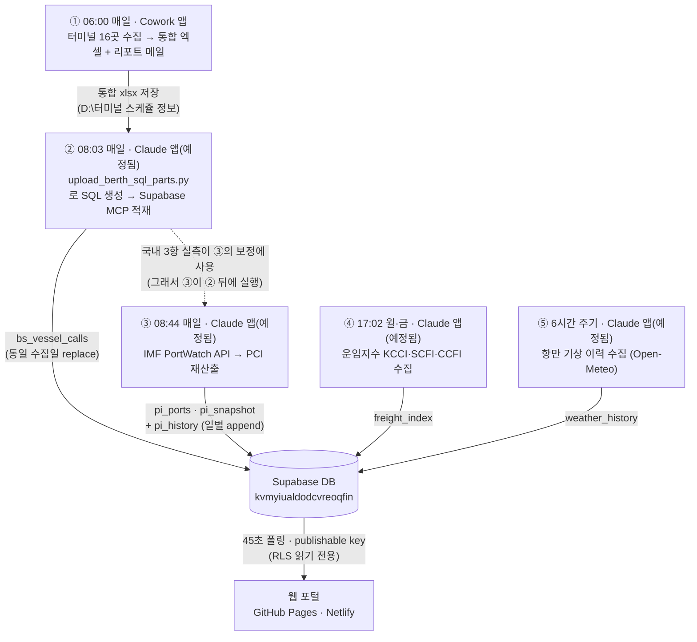

# 스케줄러 체계 (2026-07-31 기준)

TWL Control Tower의 데이터 파이프라인은 **스케줄러 5개**로 구성된다.
윈도우 작업 스케줄러는 사용하지 않으며, 전부 Claude 계열 앱의 내장 스케줄러다.

## 작업별 상세

| # | 시각 | 등록 위치 | 작업 ID | 하는 일 | 산출물 |
|---|---|---|---|---|---|
| ① | 매일 06:00 | **Cowork 앱** › 예약된 작업 | Terminal schedule collection | 터미널 16곳 웹 수집 → 터미널별/통합 엑셀 생성 → itt@twsc.co.kr 리포트 메일 | `D:\터미널 스케쥴 정보\터미널_선석배정현황_통합_YYYYMMDD.xlsx` |
| ② | 매일 08:03 | **Claude 앱** › 예정됨 | `berth-upload-supabase` | ①의 엑셀 파싱(scripts/backfill_upload_berth.py 파서) → 분할 SQL 생성(scripts/upload_berth_sql_parts.py) → Supabase MCP로 적재. 최근 7일 미적재 날짜 자동 캐치업 | `bs_vessel_calls` + `bs_collect_log` |
| ③ | 매일 08:44 | **Claude 앱** › 예정됨 | `portinsight-daily-update` | scripts/collect_portinsight_api.py --sql → MCP 실행. 부산·광양·인천 접안/대기는 ②의 실측으로 보정. 갱신 후 `pi_history`에 일별 스냅샷 append(예측 분석용) | `pi_ports`(93) · `pi_snapshot` · `pi_history` |
| ④ | 월·금 17:02 | **Claude 앱** › 예정됨 | `freight-index-update` | scripts/collect_freight_index.py --sql → MCP 실행 (KCCI 월요일·SCFI/CCFI 금요일 발표 주기에 맞춤) | `freight_index` |
| ⑤ | 6시간 주기(00·06·12·18시) | **Claude 앱** › 예정됨 | `weather-history-collect` | scripts/collect_weather_history.py --sql → MCP 실행. 부산신항·광양·인천 파고·풍속 이력 축적(예측 분석 Phase 1, 2026-07-31 신설. 스키마: sql/setup_history.sql) | `weather_history` |

## 실행 모델

- 예약 시각이 되면 해당 앱이 **자율 Claude 세션을 자동 기동**하고, 그 세션이 지침(SKILL.md)대로 .py 실행·MCP 적재·검증·결과 보고까지 수행한다.
  ②③④의 지침 파일: `C:\Users\Administrator\.claude\scheduled-tasks\<작업ID>\SKILL.md`
- **service_role 키가 PC에 저장되지 않는다** — .py는 SQL 파일만 생성하고, DB 쓰기는 Claude 세션이 Supabase MCP로 실행한다(--sql 모드).
- 모든 적재는 **동일 수집일 delete 후 insert(멱등)** — 재실행·중복 실행에 안전하다.
- **앱이 켜져 있어야 실행된다.** 꺼져 있으면 다음 앱 실행 시점에 밀린 작업이 돈다. 절전 모드 방지 옵션을 켜둘 것.

## 실행 확인 위치

1. Cowork 앱 › 예약된 작업(①) / Claude 앱 사이드바 › 예정됨(②③④) — 실행 이력과 회차별 결과 보고
2. 포털 **데이터 현황(status.html)** — 파이프라인 최신성 게이지·최근 7일 적재 타임라인 (관리자 전용)
3. DB 직접 확인: `select * from bs_collect_log order by created_at desc limit 7;`

## 변경 이력

- 2026-07-31: ②③④ 신규 등록. ③은 당초 07:04였으나 ②(08:03) 이후로 조정 — 국내 3항 보정이 전일이 아닌 당일 실측을 쓰도록 순서 결함 수정. 파서를 헤더 변형(MAP 후보 리스트·공백 무시·`@@` 제거·푸터 행 필터)에 대응하도록 보강.
- 2026-07-31 (예측 분석 Phase 1): ⑤ `weather-history-collect` 신설(6시간 주기) + ③에 `pi_history` 일별 스냅샷 append 단계 추가. 이력 테이블 2종 생성(`sql/setup_history.sql`) — 파고×접안 지연 상관, PCI 추세 예측 등의 원천 데이터 축적 시작.
